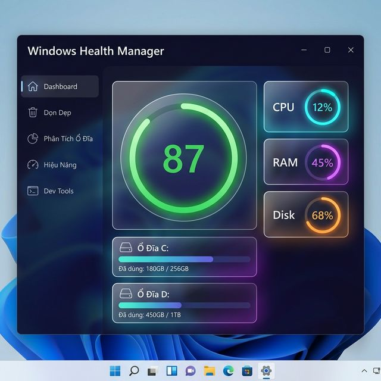
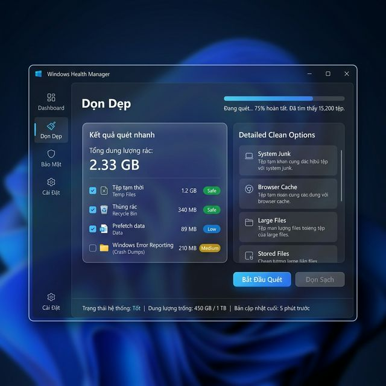

<!-- markdownlint-disable MD033 MD041 -->
<div align="center">
  

  # Windows Health Manager

  **Công cụ tối ưu & bảo vệ Windows dành cho lập trình viên.**

  [](https://dotnet.microsoft.com/)
  [](https://www.microsoft.com/windows)
  []()
  []()
  [](https://github.com/ngphong01/winvitals/releases/latest)

</div>

---

## 📸 Giao Diện

<div align="center">

  
  <br/><sub>Dashboard — Health Score, Drive Usage, Thống kê hệ thống</sub>

  <br/><br/>

  
  <br/><sub>Dọn Dẹp — Quét & xóa file rác an toàn với Risk Engine đa lớp</sub>

</div>

---

## 📥 Download

| Platform | Download | Ghi chú |
|---|---|---|
| Windows 10/11 x64 | [**WinHealth.exe**](https://github.com/ngphong01/winvitals/releases/latest/download/WinHealth.exe) | ~129 MB, portable |
| Windows 10/11 x86 | [WinHealth-x86.exe](https://github.com/ngphong01/winvitals/releases/latest/download/WinHealth-x86.exe) | ~120 MB, portable |

> **Portable** — không cần cài đặt, không cần .NET runtime. Tải về → double-click để chạy.

---

## ⚙️ Yêu Cầu Hệ Thống

| Yêu cầu | Chi tiết |
|---|---|
| **Hệ điều hành** | Windows 10 (1903+) hoặc Windows 11 |
| **Quyền hạn** | Một số tính năng yêu cầu **Run as Administrator**: xóa file hệ thống, đăng ký Task Scheduler, can thiệp Registry startup |
| **RAM** | Tối thiểu 4 GB RAM |
| **Ổ đĩa** | ~150 MB trống để giải nén + database |
| **.NET** | Đã tích hợp sẵn — **không cần cài thêm** |

> ⚠️ Khi chạy lần đầu mà không có quyền Admin, các tính năng liên quan đến Task Scheduler và System32 sẽ bị bỏ qua tự động — ứng dụng vẫn hoạt động bình thường với các tính năng còn lại.

---

## 🎯 Mục Đích

Windows Health Manager là ứng dụng **quản lý sức khỏe và tối ưu hóa Windows** toàn diện — tương tự CCleaner nhưng được thiết kế dành riêng cho **lập trình viên** và người dùng nâng cao. Ứng dụng giúp:

- 🗑️ Dọn sạch file rác, cache hệ thống, cache trình duyệt và cache công cụ lập trình
- 📊 Theo dõi hiệu năng CPU / RAM / Disk realtime
- 💾 Phân tích và tối ưu dung lượng ổ đĩa
- 🔒 Bảo vệ an toàn tuyệt đối — không xóa nhầm file quan trọng
- ⏰ Tự động dọn dẹp theo lịch

---

## 🧭 Các Chức Năng Chi Tiết

### 🏠 Dashboard — Tổng Quan Sức Khỏe Máy
- **Health Score**: Điểm tổng hợp 0–100 (CPU, RAM, Disk, lịch sử dọn dẹp)
- **Drive Cards**: Hiển thị dung lượng đang dùng / tổng dung lượng từng ổ đĩa với progress bar màu
- **Thống kê**: Tổng dung lượng đã dọn được, ước tính có thể thu hồi thêm
- **Quick Actions**: Nút dọn nhanh và xem gợi ý tối ưu

---

### 🧹 Dọn Dẹp (Cleaner)

#### Quét Nhanh (Quick Scan)
Dọn các file rác an toàn 100%, không cần xác nhận:
- `%TEMP%` — file tạm thời của Windows và ứng dụng
- Recycle Bin — thùng rác
- Windows Prefetch — cache khởi động ứng dụng
- Crash dumps & minidump (`.dmp`, `.mdmp`)
- Log files hệ thống

#### Quét Sâu (Deep Scan)
Phân tích toàn bộ ổ đĩa, tìm:
- **File lớn** (> 100 MB): video, ISO, archive cũ, backup file
- **File trùng lặp**: quét theo SHA-256 hash
- **File mồ côi** (Orphan): thư mục còn sót sau khi gỡ cài đặt app
- **Cache đám mây**: OneDrive, Google Drive, Dropbox, iCloud
- **Cache Windows Store** & Windows Update
- **Cache trình duyệt**: Chrome, Edge, Firefox, Brave, Opera, Chromium

#### Dev Tools — Dành Cho Lập Trình Viên
Quét và dọn 27 cache công cụ lập trình phổ biến:

| Công cụ | Thư mục cache |
|---|---|
| npm / Node.js | `~\AppData\Roaming\npm-cache` |
| Yarn | `~\AppData\Local\Yarn` |
| pnpm | `~\AppData\Local\pnpm` |
| Python pip | `~\AppData\Local\pip\cache` |
| uv / Conda | `~\AppData\Local\uv\cache`, `~\miniconda3\pkgs` |
| .NET NuGet | `~\.nuget\packages` + HTTP cache |
| Rust Cargo | `~\.cargo\registry` + `target` |
| Go module | `~/go/pkg/mod` + build cache |
| Gradle | `~\.gradle\caches` |
| Maven | `~\.m2\repository` |
| Dart / Flutter | Pub cache + `.dart-tool` |
| Docker | Docker Desktop data + logs |
| Android SDK | build cache + temp |
| PHP Composer | `~\AppData\Roaming\Composer` |

**Stale Project Detector**: Tìm dự án code không hoạt động (> 60 ngày không commit) và liệt kê các thư mục cache có thể dọn (`node_modules`, `build`, `dist`, `bin`, `obj`, `target`, `.gradle`, `__pycache__`...). **Chỉ xóa thư mục cache cụ thể — không bao giờ xóa thư mục gốc của dự án.**

---

### 💾 Phân Tích Ổ Đĩa
- Xem dung lượng từng thư mục theo dạng cây
- Kiểm tra sức khỏe SSD/HDD qua **SMART**
- Phân tích file lớn và gợi ý hành động phù hợp

---

### ⚡ Hiệu Năng (Performance)
Monitor realtime cập nhật mỗi 3 giây:
- **CPU**: % sử dụng, số nhân
- **RAM**: Đang dùng / Tổng RAM (GB)
- **Disk**: % dùng, dung lượng trống
- **Tiến trình**: Top 20 tiến trình tốn RAM nhất
- **Startup apps**: Xem và vô hiệu hóa app khởi động cùng Windows (Registry)

---

### 🔒 Cách Ly & Khôi Phục (Quarantine)
- File rủi ro cao không bị xóa ngay — **di chuyển vào khu cách ly**
- Giữ file **14 ngày** trước khi xóa vĩnh viễn
- Có thể **khôi phục** về vị trí ban đầu bất cứ lúc nào

---

### ⏰ Tự Động & Lịch (AutoClean)
- Tích hợp **Windows Task Scheduler** *(yêu cầu Admin)*
- Đặt lịch dọn tự động: theo giờ, ngày, tuần
- Chọn preset: Quick / Deep / Developer

---

### 📋 Bộ Quy Tắc (Rule Engine)
Engine quy tắc JSON — hoàn toàn tùy chỉnh:
- Quy tắc theo **path pattern** (glob `**\Temp\**`)
- Quy tắc theo **đuôi file** (`.iso`, `.dmp`, `.log`)
- Quy tắc theo **kích thước** và **tuổi file**
- **Action**: `SafeDelete` / `WarnDelete` / `Quarantine` / `Block`
- Hỗ trợ **Community Rule Packs**: tải rule từ cộng đồng

---

## ️ An Toàn Tuyệt Đối

| Lớp bảo vệ | Chi tiết |
|---|---|
| **System Rules** | `Windows\System32`, `SysWOW64`, `WinSxS`, `Drivers`, `Installer` — Block vĩnh viễn |
| **User Folders** | `Desktop`, `Documents`, `Pictures`, `Videos`, `Music`, `OneDrive` — không bao giờ xóa |
| **Database & Credentials** | `.db`, `.sqlite`, `.env`, `.pem`, `.key`, `.pfx` — Block |
| **Risk Engine** | Mỗi file được chấm điểm rủi ro: Safe / Low / Medium / High / Critical |
| **Quarantine** | File rủi ro cao được cách ly 14 ngày, không xóa thẳng |
| **Project Root Guard** | Phát hiện `.git`, `*.sln`, `package.json`, `go.mod` — không xóa thư mục gốc dự án |
| **Preview Mode** | Xem trước danh sách file sẽ xóa trước khi thực thi |

---

## 🏗️ Kiến Trúc

```
Scanner → RuleEngine → RiskEngine → Cleaner → Quarantine / Delete
```

```
src/
├── App.Core/           # Interfaces, models, enums, value objects
├── App.Scanner/        # 7 scanners (Disk, LargeFile, Orphan, Duplicate, Browser, Cloud, DevCache, Stale)
├── App.Cleaner/        # RuleEngine, RiskEngine, QuickCleaner, DeepCleaner, DeveloperCleaner, Quarantine, Scheduler
├── App.Performance/    # CPU/RAM/Disk realtime + startup manager
├── App.Storage/        # LiteDB + repositories (Clean, Quarantine, Rule, Scan, Performance)
├── App.UI/             # WPF Frontend (Fluent Dark / Glassmorphism) + ViewModels
└── App.Tests/          # 113 unit tests (xUnit + FluentAssertions)
```

| Layer | Technology |
|---|---|
| Runtime | .NET 9.0 WPF |
| UI Style | Fluent Dark + Glassmorphism |
| Database | LiteDB (embedded NoSQL, zero-config) |
| Logging | Serilog |
| System APIs | PerformanceCounter, WMI, P/Invoke (kernel32) |
| DI | Microsoft.Extensions.DependencyInjection |
| Testing | xUnit + FluentAssertions |

---

## 🚀 Dev Setup

```bash
git clone https://github.com/ngphong01/winvitals.git
cd winvitals

dotnet build WindowsHealthManager.sln
dotnet test WindowsHealthManager.sln         # 113 tests
dotnet run --project src/App.UI             # Chạy ứng dụng

# Publish portable exe
dotnet publish src/App.UI -c Release -o ./publish            # x64
dotnet publish src/App.UI -c Release -r win-x86 -o ./publish-x86  # x86
```

---

## 🤝 Đóng Góp (Contributing)

Mọi đóng góp đều được chào đón! Dưới đây là cách tham gia:

**Báo lỗi / Đề xuất tính năng:**
1. Mở [Issue](https://github.com/ngphong01/winvitals/issues/new/choose) và chọn template phù hợp
2. Mô tả rõ: hệ điều hành, phiên bản Windows Health Manager, và các bước tái hiện lỗi

**Gửi Pull Request:**
1. Fork repo → tạo branch mới: `git checkout -b feature/ten-tinh-nang`
2. Viết code + đảm bảo test pass: `dotnet test`
3. Tạo Pull Request với mô tả rõ ràng về thay đổi

**Viết Rule Pack:**
- Rule Pack là file `.json` trong thư mục `rules/` theo format có sẵn
- Gửi PR để thêm vào bộ Community Rule Packs

Xem thêm chi tiết trong [CONTRIBUTING.md](CONTRIBUTING.md) *(coming soon)*

---

## 📄 License

MIT © [ngphong01](https://github.com/ngphong01)

<div align="center">
  <sub><a href="https://github.com/ngphong01/winvitals">github.com/ngphong01/winvitals</a></sub>
</div>
